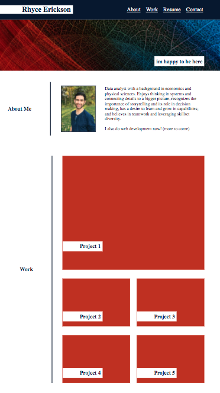

# main-page
## Web Dev Portfolio Assignment

# Welcome to my portfolio! 

In this repository you will find:
* `instructions` folder containing assignment details
* `assets` folder containing:
    * `css` folder of css style
    * `images` folder containing images found on main page and a python file for extracting matching colors from banner image
----
https://arerickson28.github.io/main-page/  

---
*image of portfolio page*  
